# One Pixel BLE Camera

A minimalist camera that scans a scene pixel by pixel using a single BPW34 photodiode mounted on a pan/tilt servo rig. Pixel data is transmitted wirelessly via Bluetooth Low Energy (BLE) to an iOS app that reconstructs the image in real time.

---

> **Disclaimer** — This project was built as a demo for an introductory talk on Bluetooth Low Energy. The technique used to render the image on the iOS side — a `LazyVGrid` of 16,000 rectangles — is intentionally suboptimal: in a real-world app, you would use a `Canvas` for per-pixel drawing or convert the data directly to a `UIImage`. This approach was a deliberate choice for the talk, to make the BLE data flow visually explicit and pedagogically clear.

---

## How It Works

Instead of an image sensor array, this camera moves a single photodiode across a 160×100 grid using two SG90 servo motors — one for horizontal pan, one for vertical tilt. At each position, the microcontroller reads the ambient light level and transmits it over BLE. The iOS app receives each pixel as it is captured and assembles the final grayscale image.

- **Resolution**: 160 × 100 pixels
- **Sensor**: BPW34 photodiode (10-bit ADC, 0–1023 range)
- **Scan time**: ~6–7 minutes per image
- **Connectivity**: Bluetooth Low Energy (BLE)

---

## Hardware

### Assembly

### PCB

| Front | Back |
|-------|------|
| 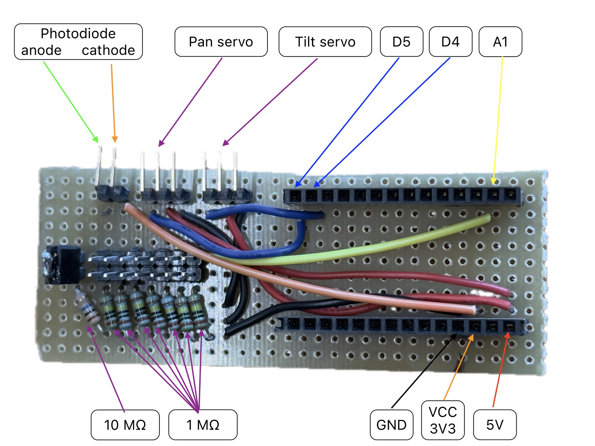 | 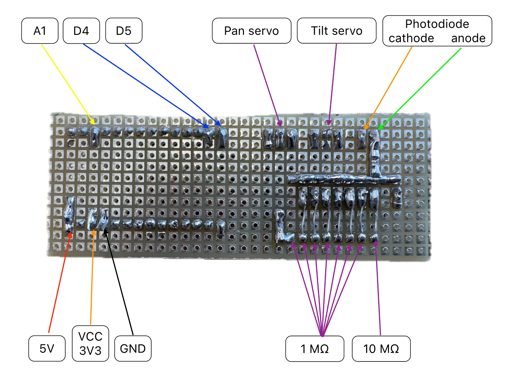 |

### Final Assembly

| Front | Back |
|-------|------|
| 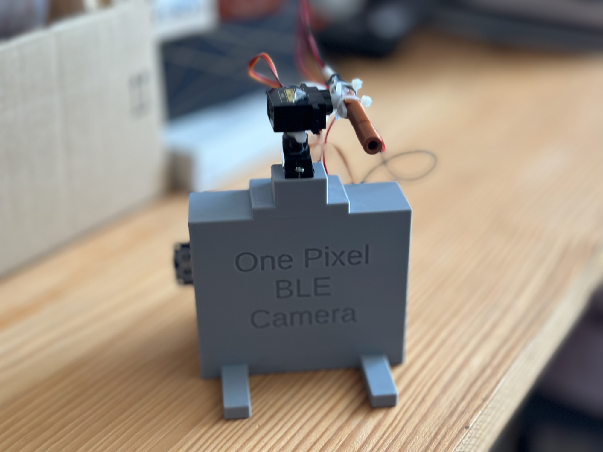 | 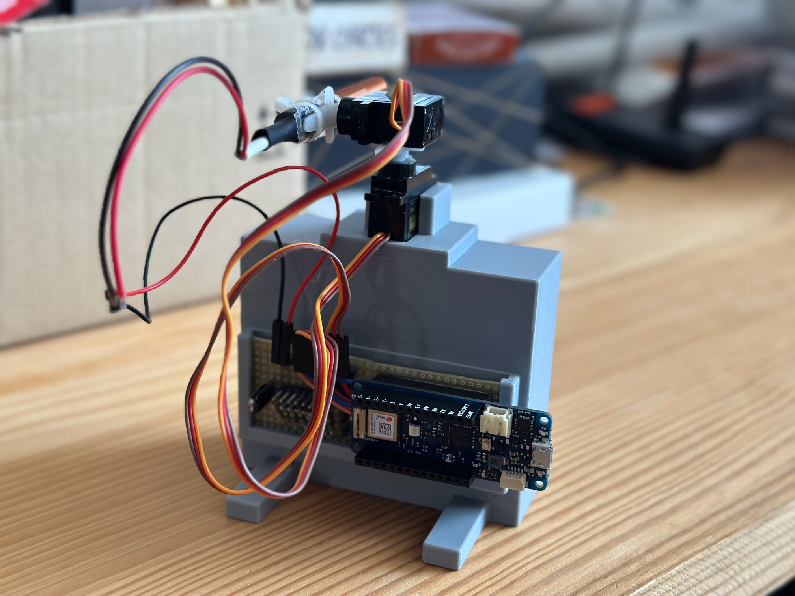 |

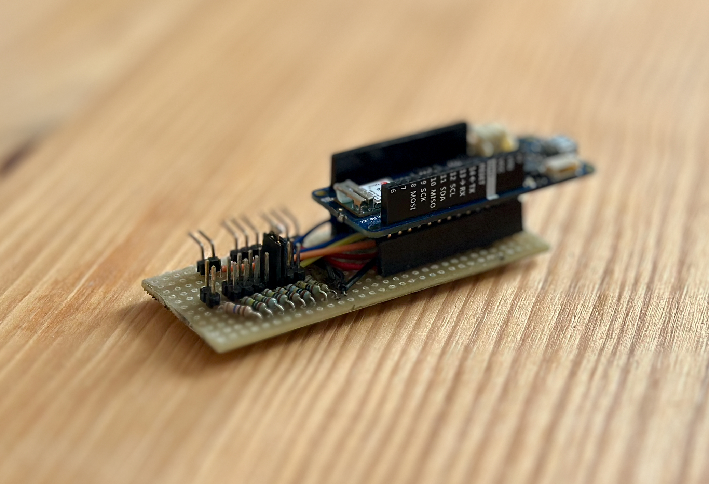

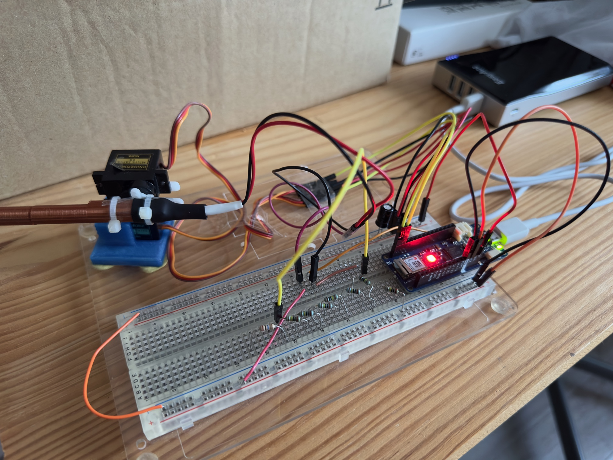

### Bill of Materials

| Component | Qty |
|---|---|
| Arduino MKR WIFI 1010 | 1 |
| SG90 servo motor | 2 |
| BPW34 photodiode | 1 |
| 10 MΩ resistor | 1 |
| 1 MΩ resistor | 7 |
| Wire | — |
| Male headers 1×2 | 8 |
| Angled male header 1×2 | 1 |
| Angled male header 1×3 | 2 |
| Female header 1×14 | 2 |
| PCB Perfoboard | — |

The photodiode is read through a resistive voltage divider. The pull-down resistor value directly affects dynamic range and sensitivity: a higher resistance produces more signal swing but also increases noise. Results were captured with 7 MΩ and 17 MΩ pull-down configurations.

### 3D-Printed Parts

The enclosure is designed in OpenSCAD. Source files are in [`3dFiles/`](3dFiles/):

- `cameraAssembly.scad` — main body with servo mounts
- `bpw34_support.scad` — photodiode holder (optimised for ~70 mm focal distance)

---

## Firmware

The Arduino sketch runs on the MKR WIFI 1010 and is located in [`arduino/onePixelBleCamera/src/main.cpp`](arduino/onePixelBleCamera/src/main.cpp).

**BLE service layout:**

| | UUID |
|---|---|
| Service | `688c6011-fa63-429b-bea4-18517d46c9ee` |

| Characteristic | UUID | Direction | Description |
|---|---|---|---|
| Status | `cbedefb3-b8ec-4656-b7db-96271f7f33d2` | Write / Notify | `0` = ready, `1` = capturing, `2` = disconnected |
| Pixel data | `081458cb-264d-4b7f-8007-4e0cfbbe2300` | Notify | `"<index>#<value>"` or `"EOT"` |

**Scan sequence:**

1. Tilt servo steps through 100 rows (1000–2000 µs).
2. For each row, pan servo sweeps 160 columns (2080–800 µs, right to left).
3. At each position: 20 ms settle → 4 ADC reads averaged → value transmitted over BLE.
4. After all 16 000 pixels, `"EOT"` is sent to signal completion.

**Status LED** (built-in RGB on the MKR WIFI 1010):

| Color | State |
|---|---|
| Red | Disconnected |
| Blue | Ready to capture |
| Green | Capturing |

---

## iOS App

The companion app is a SwiftUI application located in [`ios/OnePixelBleCamera/`](ios/OnePixelBleCamera/).

| Scanning | Done |
|---|---|
| 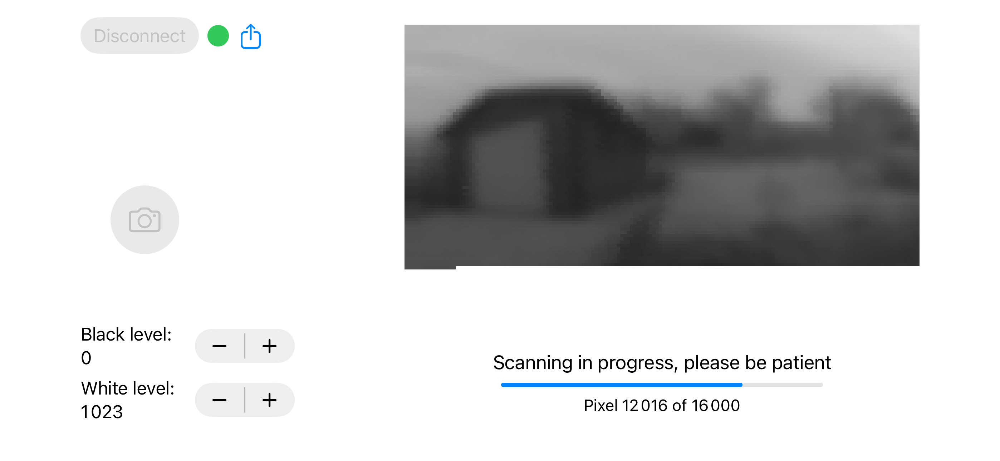 | 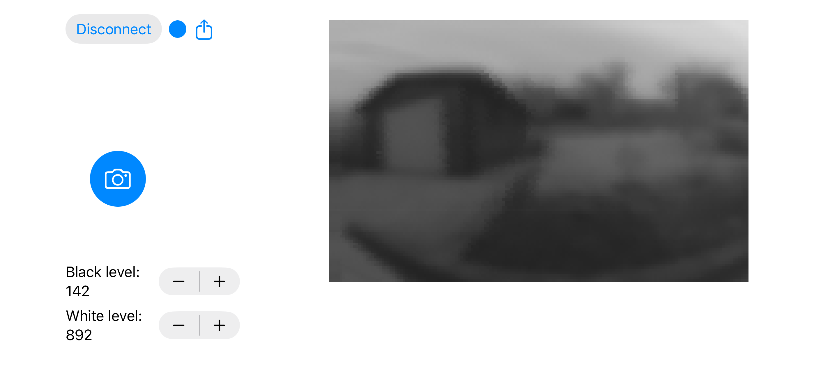 |

**Features:**

- Scans for the `"1Pixel Camera"` BLE device and connects automatically.
- Displays a live pixel grid (160×100, rendered at 3× scale) as the scan progresses.
- Adjustable black and white levels for contrast stretching.
- Exports the final image as a JPEG via the system share sheet.
- Disables the idle timer during capture to prevent screen sleep.

---

## Demo

The camera scanning a scene pixel by pixel, and the companion app assembling the image in real time over BLE.

| Camera | iOS App |
|--------|---------|
|  | 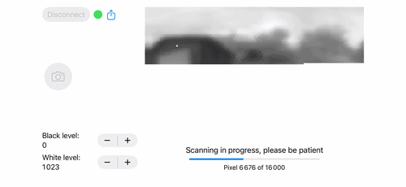 |

---

## Results

Reference images were captured in controlled conditions. Subsequent images were taken outdoors under varying weather to evaluate the camera's sensitivity and long-term stability.

### Reference

| Front | Back |
|-------|------|
| 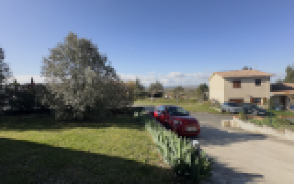 | 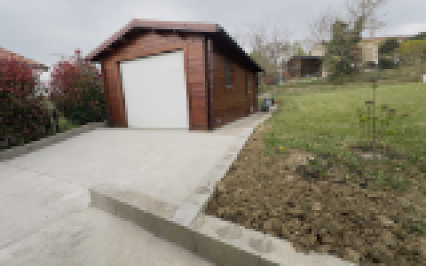 |

### Pull-down resistance: 7 MΩ

| Condition | Front | Back |
|---|---|---|
| Sunny | 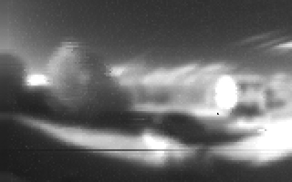 | 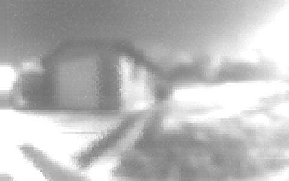 |
| Cloudy | 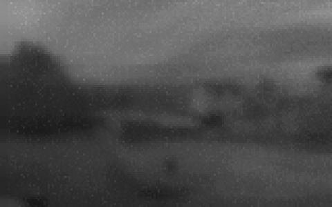 | — |

### Pull-down resistance: 17 MΩ

| Condition | Back |
|---|---|
| Cloudy | 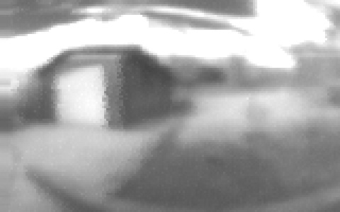 |
| Rainy | 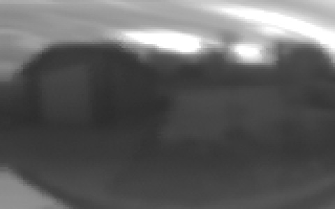 |

---

## Project Structure

```
onePixelBleCamera/
├── arduino/          # Firmware (PlatformIO / Arduino MKR WIFI 1010)
├── ios/              # iOS companion app (SwiftUI)
├── kicad/            # PCB schematic and layout
├── 3dFiles/          # OpenSCAD enclosure models and STL exports
├── bom/              # Bill of materials
└── images/           # Assembly photos, app screenshots, and result images
```
